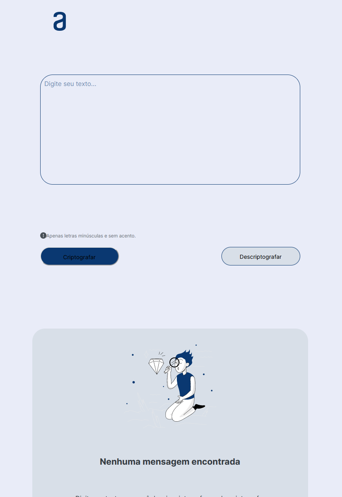
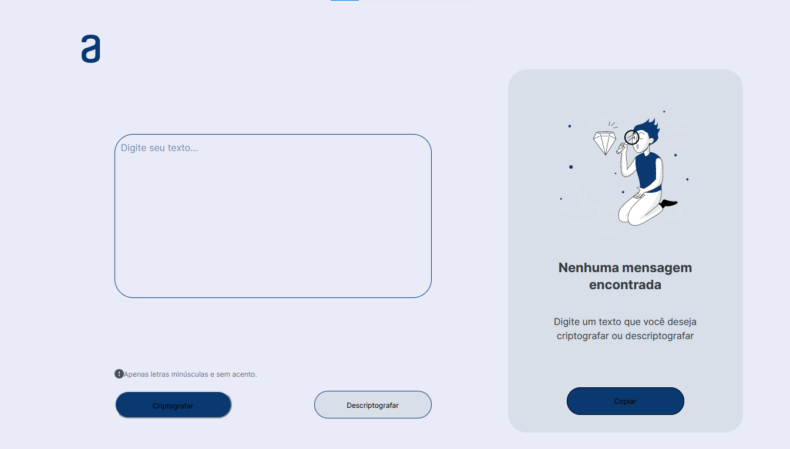
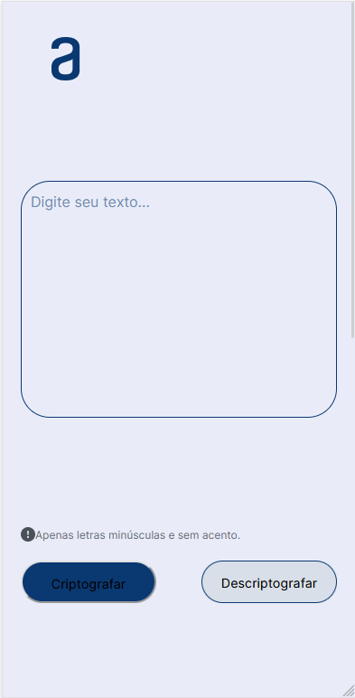

# Challenge One - Decodificador de Texto

Este projeto é um decodificador de texto simples que criptografa e descriptografa mensagens. Foi desenvolvido como parte do curso de HTML e CSS da Alura.

## Descrição

O Decodificador de Texto é uma aplicação web que permite criptografar e descriptografar mensagens. Ele segue a lógica de substituir vogais por palavras específicas, proporcionando uma forma lúdica de codificação.

## Imagens

## Tecnologias Utilizadas

- HTML
- CSS
- JavaScript

## Instruções de Uso

1. Abra o arquivo `index.html` em um navegador web.
2. Digite o texto desejado na caixa de texto.
3. Clique no botão "Criptografar" para codificar a mensagem.
4. Clique no botão "Descriptografar" para decodificar a mensagem.
5. Utilize o botão "Copiar" para copiar o resultado para a área de transferência.

## Funcionalidades

- Criptografar texto substituindo vogais por palavras específicas.
- Descriptografar texto revertendo a codificação.
- Copiar o resultado para a área de transferência.

## Estilos e Responsividade

O projeto apresenta um design simples e responsivo, adaptando-se a diferentes tamanhos de tela. Foram utilizadas folhas de estilo CSS para garantir uma experiência agradável ao usuário.

## Contato

Para dúvidas ou colaborações, entre em contato:

- Instagram: [RaoniCL](https://www.instagram.com/raonircl/)
- Linkedin: [Raoni Cerqueira](https://www.linkedin.com/in/raoni-cerqueira-027026211/)
- GitHub: [RaoniCL](https://github.com/raonircl)

© 2024 - Projeto desenvolvido durante o curso HTML e CSS da Alura.

---